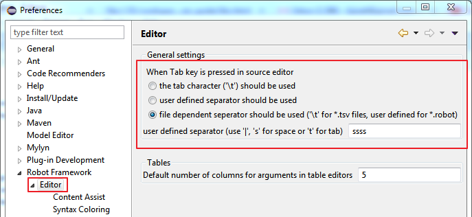
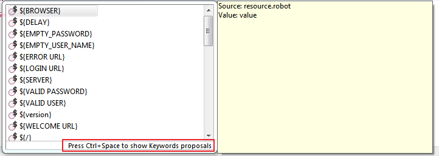
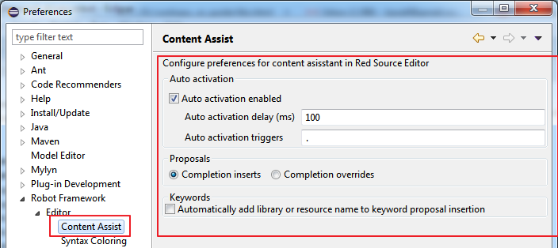
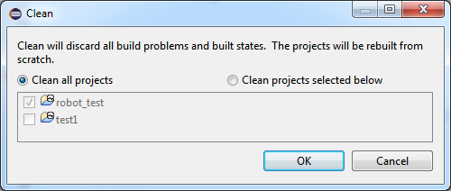
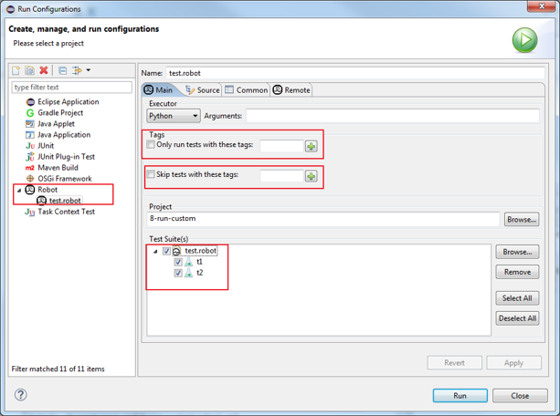
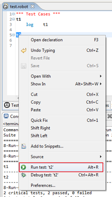

## General usage hints

### Tab key behavior

Tab key behavior is set by default to be aware of the file type. For .tsv
files each Tab will produce item separator, for text files 4 spaces will
generated.  
In Robot Framework preferences (Window -> Preferences), Tab behavior can be
changed if needed.  
  
  
  

### Content assistance - mode of working & preference

Content assistance is a functionality provided by Eclipse platform extended to
understand Robot data model.  
It is invoked by pressing CTRL+SPACE key short-cut. It has multiple modes
which are cycled by CTRL+SPACE, next mode type is visible at the bottom of
assist window.  
  
  
  

#### Content assistance preferences

Behavior of content assist can be changed in Robot Framework preferences
(Window -> Preferences).  
Proposed items can be put into testcase by either by insert or override.  
It can also be configured if library/resource prefix should ba always used
when accepting content proposal.  
  
  
  

### Validating & revalidating whole project/workspace

Validation of test case is triggered by any user actions, it is also done
during files&amp;project; imports.  
Whenever there is a change in multiple files (for instance find&amp;replace;)
or big file import/deletion, it is good to force revalidation of project.  
It is done accessing option Project -> Clean ...  
  
  
  
At the bottom right of RED, progress bar will appear with the status of
validation.  

### Automatic source formatting CTRL+SHIFT+F

Formatting source is Eclipse based mechanism which provides code formatting
with arbitrary ruleset.  
For now, **code formatting in RED is meant to be proof of functionality, it is
not configurable.**  
In near future we will provide a way to include custom rule sets for code
formatting and check style.  
It is invoked by clicking in text editor in issuing right click action Format
source  
  
  
  
  

### Quick Fix - Ctrl+1

Quick Fix is an Eclipse mechanism to provide user with predefined action for
solving issues. If the Quick Fix action is available, light bulb icon is shown
next to line number.  
  
  
  
Quick Fix can be accessed by clicking on underlined item and choosing from
right click menu Quick Fix or directly by Ctrl+1.

#### Running selected test case

RED can run or debug one, selected testcase. This can be achieved by altering
Run Configuration :  
  
  
  
and also by placing cursor on testcase body and using right click menu:  
  
  
  

